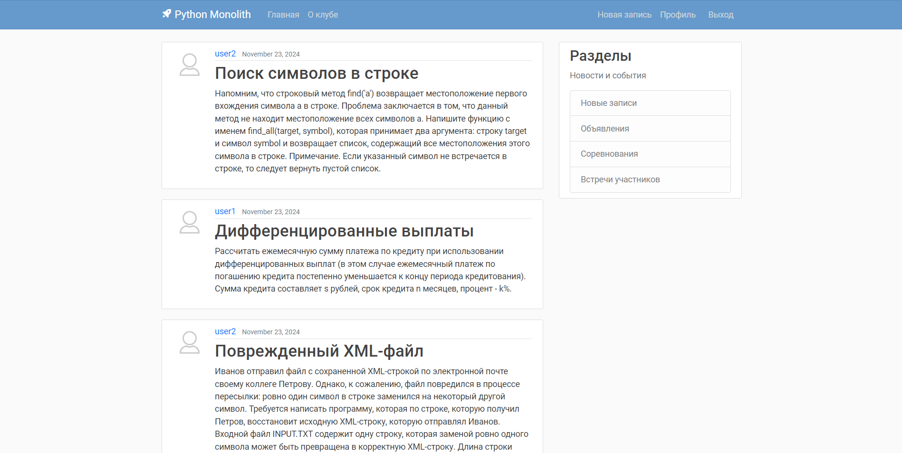
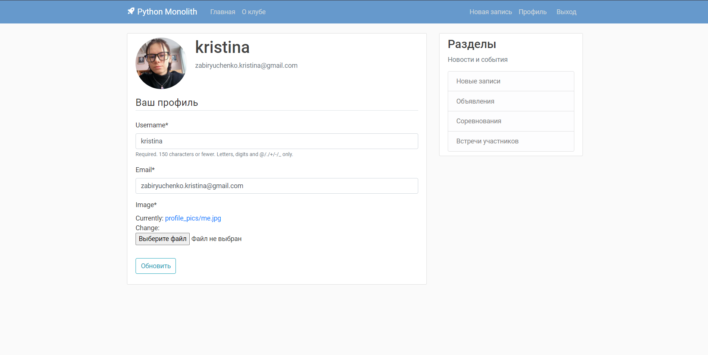
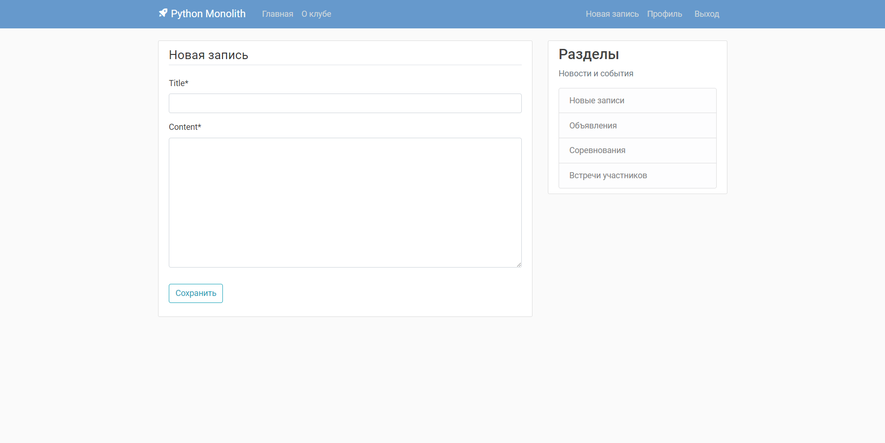
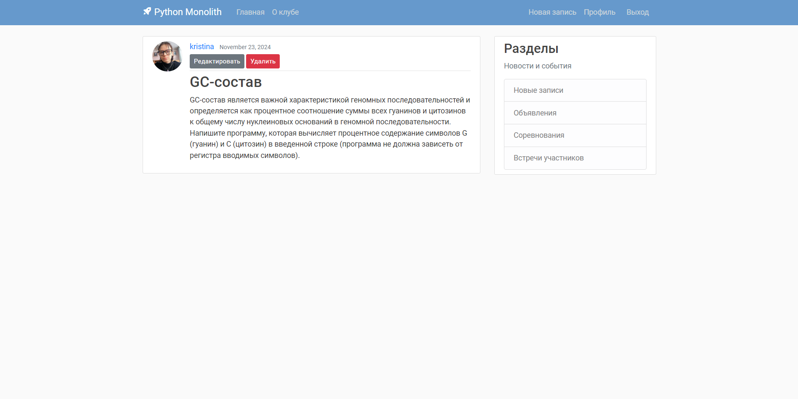
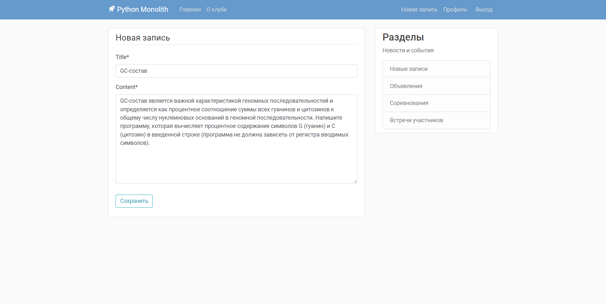

# Многопользовательский Блог "Monolith" на Django

Это приложение представляет собой многопользовательский блог, разработанный с использованием Django. Пользователи могут
регистрироваться, создавать свои профили и публиковать посты. Блог поддерживает функциональность управления
пользователями и профилями.

## Описание проекта

Блог позволяет пользователям делиться своими мыслями и идеями через посты. Каждый пользователь может создавать свои
записи, редактировать их и просматривать записи других пользователей. Приложение также включает в себя возможность
управления профилем пользователя.

## Функциональные возможности

- Регистрация и аутентификация пользователей
- Создание, редактирование и удаление постов
- Просмотр профиля пользователя с возможностью его редактирования
- Возможность просмотра постов других пользователей
- Использование Bootstrap для стилизации интерфейса

## Скриншоты

### Главная страница блога



### Страница профиля пользователя



### Страница создания нового поста


### Страница просмотра поста пользователя


### Страница редактирования поста пользователя


## Установка

Следуйте этим шагам для установки и запуска проекта на вашем локальном компьютере:

### 1. Клонирование репозитория

```bash
git clone https://github.com/markup-dev/django-blog.git
cd DjangoBlog
```

### 2. Создание виртуального окружения

Рекомендуется использовать виртуальное окружение для управления зависимостями проекта. Создайте и активируйте
виртуальное окружение:

```bash
python -m venv venv
# Для Windows
venv\Scripts\activate
# Для macOS/Linux
source venv/bin/activate
```

### 3. Установка зависимостей

Убедитесь, что у вас установлен Python 3.x и pip. Установите необходимые зависимости:

```bash
pip install -r requirements.txt
```

### 4. Настройка базы данных

Создайте базу данных SQLite (или используйте другую базу данных по вашему выбору) и выполните миграции:

```bash
python manage.py migrate
```

### 5. Создание суперпользователя

Создайте суперпользователя для доступа к административной панели:

```bash
python manage.py createsuperuser
```

### 6. Запуск сервера

Запустите сервер разработки:

```bash
python manage.py runserver
```

Теперь вы можете открыть браузер и перейти по адресу http://127.0.0.1:8000/, чтобы увидеть приложение в действии.

## Использование

- Перейдите на страницу регистрации (/register/) для создания нового аккаунта.
- Войдите в систему с помощью созданного аккаунта.
- Создайте новый пост или просмотрите существующие.
- Перейдите в свой профиль для изменения информации и изображения.

## Технологии

- Django >= 5.x — веб-фреймворк для Python.
- Bootstrap — CSS-фреймворк для стилизации интерфейса.
- Pillow >= 9.x — библиотека для обработки изображений.